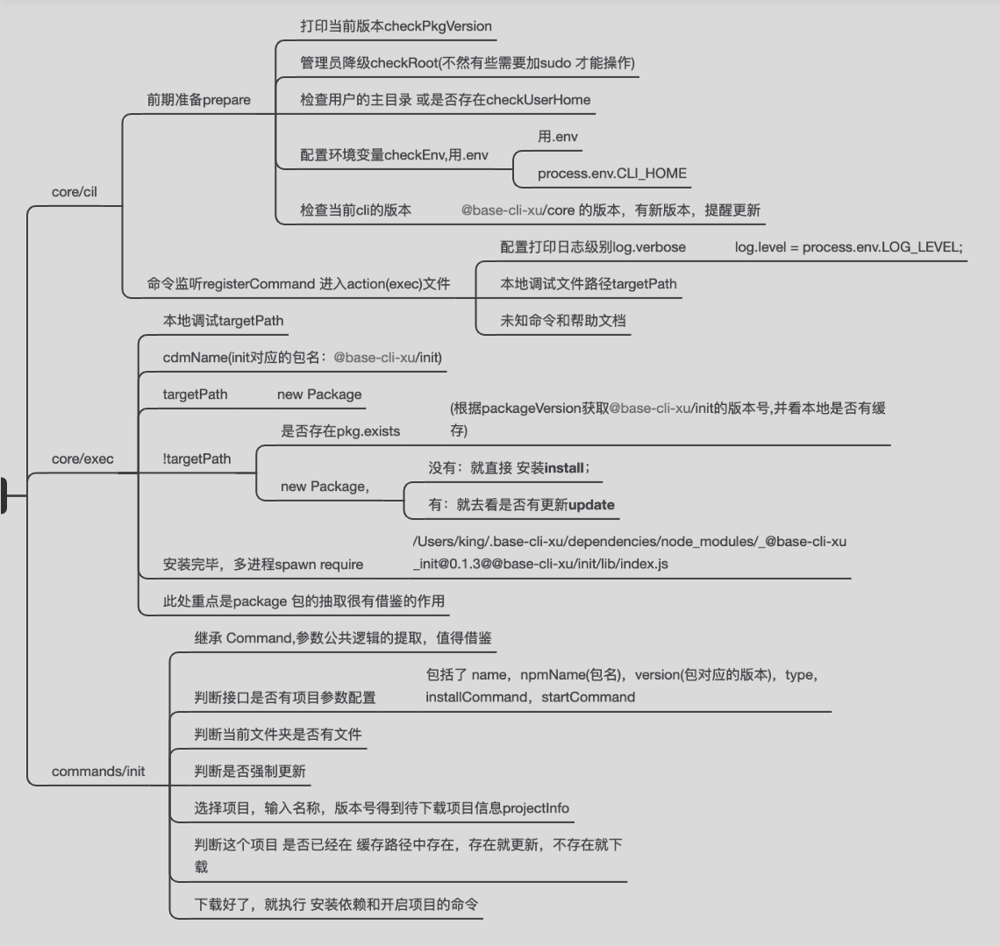

### 一、框架思维

1. 公共方法
2. 公共类的提取(包安装 package,处理包安装和更新)
3. 复用逻辑用继承 Command InitCommand
4. 逻辑严谨

主要包：

1. @base-cli-xu/core 如果有最新版本，提醒更新到最新
2. @base-cli-xu/init 如果有最新版本，直接安装

项目流程图


### 二、一些 node.js 库使用方法

```
// 版本比对包 semver
require("semver")

// 打印日志 等颜色插件
require("colors/safe")
throw new Error(
    colors.red(`base-cli-xu 需要按照V${lowestVersion}以上版本 Node`)
    );

// 管理员降级，不然有些需要加sudo 才能操作
// 超级管理员权限降级 注意版本问题，项目先用 1.0.0
require("root-check")

// 跨平台获取主文件路径
require("user-home")

// 判断文件是否存在
require("path-exists").sync

// 传参 处理 process 参数,把参数变成了对象
require("minimist")

// 环境变量 .env 的处理 配置的变量可以通过 process.env.CLI_HOME
require("dotenv")
config = dotenv.config({
    path: dotenvPath,
});

// 文件的 copy,清除,读文件
require("fs-extra")
fse.writeFileSync(filePath, res)//读
fse.copySync(templatePath, targetPath)//copy
fse.emptyDirSync(localPath)// 清空

// 找到 项目里面的package.json所在路径
require("pkg-dir").sync
pkgDir(targetPath)

// 将驼峰命名中的大写字母转换成小写并且-链接
require("kebab-case")

// 过滤 到 对应的文件路径
require("glob")

// npm 包安装和更新
require("npminstall")

// 终端动画
require("cli-spinner")

// 分级别日志输出
require("npmlog")

// 终端条件选择
require("inquirer")

// 终端 命令监听
// 安装脚手架：npm i -g @base-cli-xu/core
// 使用脚手架：base-cli-xu init
require("commander")
```

### 三、ejs 的原理

```
// 实现自定义的模板引擎

// const ejs = require('ejs'); // 第三方模块
const path = require("path");
// ejs.renderFile(path.resolve(__dirname,'template.html'),{name:'zf',age:11,arr:[1,2,3]},(err,data)=>{
//     console.log(data);
// })
const fs = require("fs");
const renderFile = (filePath, obj, cb) => {
  fs.readFile(filePath, "utf8", function (err, html) {
    if (err) {
      return cb(err, html);
    }
    // arguments[0] 就是匹配到的原字符串 arguments[1] 就是第一个原来括号
    html = html.replace(/\{\{([^}]+)\}\}/g, function () {
      // RegExp.$1
      let key = arguments[1].trim();
      return "${" + key + "}"; // {{name}} => ${name}
    });
    let head = `let str = '';\r\n with(obj){\r\n`;
    head += "str+=`";
    html = html.replace(/\{\%([^%]+)\%\}/g, function () {
      return "`\r\n" + arguments[1] + "\r\nstr+=`\r\n";
    });
    let tail = "`}\r\n return str;";
    // console.log("renderFile back:data---head-- ", head);
    // console.log("renderFile back:data---html-- ", html);
    // console.log("renderFile back:data---tail-- ", tail);
    console.log("renderFile back:data---tail-- ", head + html + tail);
    let fn = new Function("obj", head + html + tail);
    cb(err, fn(obj));
  });
};
renderFile(
  path.resolve(__dirname, "ejs-theory-template.html"),
  { name: "zf", age: 11, arr: [1, 2, 3] },
  function (err, data) {
    console.log("renderFile back:data: data ", data);
  }
);

// with的用法
const ctx = {
  user: {
    name: "rabin",
  },
};
with (ctx) {
  console.log(user.name);
}

/*
 with(obj){
str+=`

*  <!DOCTYPE html>
<html lang="en">
<head>
    <meta charset="UTF-8">
    <meta name="viewport" content="width=device-width, initial-scale=1.0">
    <title>Document</title>
</head>
<body>
    ${name} ${age}
    `
arr.forEach(item=>{
str+=`

        <li>${item}</li>
    `
})
str+=`

</body>
</html>
*
 `}
 return str;
*
*/

```

### 四、require 的原理

```
// let r = require('./a');
// console.log(this) // => {}
// console.log(r);
// const a = 1;
// const b = 2;
// function sum(x,y){
//     return x+y;
// }
// sum(a,b)

// 1.掌握node中如何实现代码调试
// https://nodejs.org/en/docs/inspector
// 1.可以在浏览器中进行调试 （调试某些模块可以使用这种方式） node --inspect-brk 文件名来解析
// √ 2.直接使用webstorm 和 vscode 自带调试方式  直接通过launch.json 进行调试
// 3.在控制台中调试

// 分析node源码
// 1.会默认调用require语法
// 2.Module.prototype.require 模块的原型上有require方法
// 3.Module._load 调用模块的加载方法  最终返回的是module.exports
// 4.Module._resolveFilename 解析文件名 将文件名变成绝对路径 默认尝试添加 .js / .json /.node
// 5.Module._cache 默认会判断是否存在缓存
// 6.new Module 创建模块(对象)   id ,exports
// 7.把模块缓存起来，方便下次使用
// ______________________ 根据文件名（绝对路径） 创建一个模块
// 8.tryModuleLoad 尝试加载模块   module.load
// 9.module.paths 第三方模块查找的路径
// 10.获取当前模块的扩展名  根据扩展名调用对应的方法Module._extensions 策略模式
// 11.获取文件的内容
// 12.调用module._compile 方法
// 13.将用户的内容 包裹到一个函数中  (function (exports, require, module, __filename, __dirname) {})

// 最终返回的是module.exports  用户会给这个module.exports进行赋值
const path = require('path');
const fs = require('fs');
const vm = require('vm');


function Module(id) {
    this.id = id;
    this.exports = {};
}
Module.wrap = function (script) {
    let arr = [
        ' (function (exports, require, module, __filename, __dirname) {',
        script,
        '})'
    ]
    return arr.join('')
}
Module._extensions = {
    '.js': function(module) {
        let content = fs.readFileSync(module.id,'utf8');
        let fnStr = Module.wrap(content);
        let fn = vm.runInThisContext(fnStr);
        let exports = module.exports;
        let require = myRequire;
        let __filename = module.id;
        let __dirname = path.dirname(module.id);
        // 这里的this 就是exports对象
        fn.call(exports,exports,require,module,__filename,__dirname);
        // 用户会给module.exports 赋值
    },
    '.json': function(module) {
        let content = fs.readFileSync(module.id,'utf8'); // 读取出来的是字符串
        module.exports = JSON.parse(content);
    }
}
Module._resolveFilename = function(filepath) {
    // 根据当前路径实现解析
    let filePath = path.resolve(__dirname, filepath);
    // 判断当前面文件是否存在
    let exists = fs.existsSync(filePath);
    if (exists) return filePath; // 如果存在直接返回路径

    // 尝试添加后缀
    let keys = Object.keys(Module._extensions);
    for (let i = 0; i < keys.length; i++) {
        let currentPath = filePath + keys[i];
        if (fs.existsSync(currentPath)) { // 尝试添加后缀查找
            return currentPath;
        }
    }
    throw new Error('模块不存在')
}
Module.prototype.load = function(filename) {
    // 获取文件的后缀来进行加载
    let extname = path.filename;
    Module._extensions[extname](this); // 根据对应的后缀名进行加载
}
Module.cache = {};
Module._load = function(filepath) {
    // 将路径转化成绝对路径
    let filename = Module._resolveFilename(filepath);

    // 获取路径后不要立即创建模块，先看一眼能否找到以前加载过的模块
    let cacheModule = Module.cache[filename];
    console.log(cacheModule);
    if(cacheModule){
        return cacheModule.exports; // 直接返回上一次require的结果
    }

    // 保证每个模块的唯一性，需要通过唯一路径进行查找
    let module = new Module(filename); // id,exports对应的就是当前模块的结果
    Module.cache[filename] = module
    module.load(filename);
    return module.exports;
}
function myRequire(filepath) {
    // 根据路径加载这个模块
    return Module._load(filepath)
}
// myRequire = require

setInterval(() => {
    let r = myRequire('./a.js');
    console.log(r,'----');
}, 1000);


// 1.require语法是同步的，fs.readFileSync
// 2.最终require语法返回的是module.exports
// 3.模块的exports 和 module.exports 引用的是同一个变量
// 4.模块是"动态"加载每次require都会获取最新的导出的结果,可以将require写到条件中
// 5.更改exports的引用 不会导致module.exports变化
// 6.循环引用，一般不会出现，如果出现只能加载部分数据


```
